  

 

  

    <b>Software Developer</b> • <b>Creative Designer</b> • <b>Video Editor</b>
  

  

    I engineer robust software solutions and craft high-end visual brand identities. Whether it's building a complex database architecture or designing a pixel-perfect commercial advertisement, I focus on delivering impact, performance, and professional excellence.
  

 

## 🚀 What I Do

<table align="center" width="100%">
  <tr>
    <td width="50%" valign="top">
      <h3 align="center">💻 Software Development</h3>
      
Building efficient applications, writing clean logic, and managing databases.

    </td>
    <td width="50%" valign="top">
      <h3 align="center">🎨 Creative Design</h3>
      
Crafting commercial marketing materials, realistic brand identities, and vector illustrations.

    </td>
  </tr>
  <tr>
    <td width="50%" valign="top">
      <h3 align="center">🎬 Video Production</h3>
      
Delivering high-quality, professional video content and tutorials.

    </td>
    <td width="50%" valign="top">
      <h3 align="center">🎓 Mentorship</h3>
      
Breaking down complex technical concepts into actionable lessons.

    </td>
  </tr>
</table>

 

## 🛠️ Tech Stack & Arsenal

 

 
 

 
 

 

## 📈 GitHub Analytics

 

 

## 📂 Highlighted Projects & Portfolio

> **[Project Name 1 - e.g., Campus Automation System]** — Built with PHP & SQL. [Link to Repo/Live]  
> **[Design Portfolio / Behance]** — Commercial branding, professional photography manipulation, and graphical ad layouts. [Link to Portfolio]  
> **[YouTube Channel / Video Portfolio]** — Tech tutorials and video content. [Link to Channel]

 

## 🤝 Let's Connect

If you have a project that needs a relentless focus on quality—whether in codebase architecture or visual design—reach out:

 

&nbsp;&nbsp;

